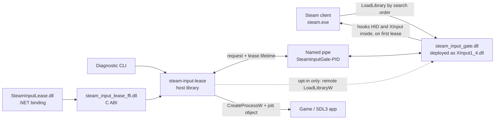

# Steam Input Lease

A Windows library that temporarily stops the running Steam client from opening, polling or
enumerating HID and XInput controllers, so a controller-sensitive application (typically SDL3) can
take direct control while Steam Input is running. It changes controller access inside the Steam
process only. It does not inject into the game, disable the Steam Overlay, restart or terminate
Steam, install a driver, hide a controller from Windows, or stop any other application from
opening controllers.

Blocking is scoped to a lease. A lease is an open named-pipe connection, so if your process
crashes, blocking ends with it. The gate is a proxy DLL that Steam loads itself from its own install
directory; nothing writes into the Steam process. It is pass-through whenever no lease is held and
installs no hook until the first lease is taken. The first lease closes Steam's existing HID
handles and denies new access; concurrent leases are reference-counted; releasing the last lease
restores pass-through and asks Steam to rediscover controllers without restarting it.

Ships as a Rust API, a stable C ABI (version 4), a .NET 8 binding and a diagnostic CLI. Injection
through remote `LoadLibraryW` still exists, but only as an explicit opt-in for a launch wrapper on
a machine where the proxy is not deployed, and for this repository's own tests. A client left at
its defaults cannot inject.

> [!IMPORTANT]
> `0.1.0` enables and disables blocking dynamically but never unloads the payload DLL; it is
> deliberately pinned. See [Payload lifetime](#payload-lifetime).

Contents: [Quick start](#quick-start) · [How it works](#how-it-works) ·
[Proxy delivery](#proxy-delivery) · [Lease lifecycle](#lease-lifecycle) · [Rust](#rust) ·
[C ABI](#c-abi) · [C#](#c) · [CLI](#cli) · [Building and testing](#building-and-testing) ·
[Internals](#internals) · [Controller recovery](#controller-recovery) ·
[Payload lifetime](#payload-lifetime) · [Compatibility](#compatibility) · [Security](#security) ·
[Troubleshooting](#troubleshooting) · [Repository and artifact layout](#repository-and-artifact-layout)

## Quick start

Two files matter:

```text
steam_input_gate.dll        the payload; deployed into Steam's directory as XInput1_4.dll
steam_input_lease_ffi.dll   the C ABI your application loads (or the .NET binding over it)
```

1. Deploy the payload before Steam starts. Copy `steam_input_gate.dll` into Steam's install
   directory as `XInput1_4.dll`. If another program already owns that name (ValvePlug and Special K
   use the same vector), use `dinput8.dll` instead. Steam maps the file on its next cold start; a
   running Steam does not pick it up.
2. Take a lease from your application through the Rust crate, the C ABI or the .NET binding. The
   default client connects to the payload Steam already loaded and never injects.
3. Release when your controller-sensitive surface closes. Dropping the handle is enough; an
   explicit release additionally reports the outcome.

Deployment is the consumer's job: this library ships the DLL and its ownership marker, and the
consumer copies, updates and parks it. WSGM's `Core\SteamInputShim.cs` is the reference deployer;
its rules are under [Deploying the proxy](#deploying-the-proxy). For a per-game launch wrapper the
reference consumer is `WSGM.Launch.exe`
(`"…\WSGM.Launch.exe" [--deelevate] [--input-lease] -- %command%`). The `steam-input-lease.exe` in
this repository is a diagnostic tool, not the user-facing wrapper.

## How it works



1. Steam starts and maps the proxy from its own directory. `DllMain` records the image, pins it and
   starts one worker thread; the worker resolves the real System32 module, releases the forwarders
   and opens the control pipe.
2. The host finds `steam.exe` in the caller's Windows session and connects to
   `\\.\pipe\SteamInputGate-<pid>`. A default client fails with `PayloadUnavailable` when nothing
   answers; only a client that opted in to injection loads `steam_input_gate.dll` through remote
   `LoadLibraryW` and retries.
3. `AcquireLease` installs the hooks if this is the first lease the process has seen, then
   increments the global lease count. On the zero-to-one transition the payload finds, cancels I/O
   on and closes Steam's existing HID handles.
4. While the count is nonzero, HID opens, HID I/O and XInput queries are denied inside Steam.
5. `ReleaseLease`, pipe EOF or handle disposal decrements the count. At one-to-zero the hooks
   become pass-through immediately and controller rediscovery is requested.

Protocol version `1`. Requests are 8 bytes, responses 24: fixed-width `#[repr(C)]` structs shared
by the host, payload and C ABI. A payload whose hook installation fails answers the acquire with
`HookInstallFailed` instead of granting a lease.

While a lease is held, Steam sees the same class of failures it would see if the controller had
been unplugged; the controller stays available to everything else. The HID boundary is
controller-agnostic: any HID handle Steam owns can be gated, not just Valve hardware. XInput state
and capability queries are gated both in the proxy forwarders and across the supported system
XInput DLLs.

## Proxy delivery

Everything in this section was learned against a live client, most of it from Steam hanging on a
cold boot. The constraints are also commented at the code that enforces them
(`crates/steam-input-gate/src/proxy.rs`, `DllMain`, `build.rs`).

Two properties of Steam make a search-order proxy safe, both verified on a live client. Nothing in
`steam.exe` hardens the search order: no `SetDefaultDllDirectories` or `AddDllDirectory`, and the
lone `SetDllDirectoryA` in `SteamUI.dll` cannot displace the application directory. Nothing in
Steam's directory statically imports XInput or DirectInput, so a missing export degrades a
`GetProcAddress` to NULL instead of failing a load.

### Vectors

The payload classifies itself from the file name Steam loaded it under:

| File name | Vector | Forwards to |
| --- | --- | --- |
| `XInput1_4.dll` | primary | `System32\XInput1_4.dll` |
| `dinput8.dll` | fallback, when the primary name is owned by another program | `System32\dinput8.dll` |
| `steam_input_gate.dll` | injected (opt-in and tests) | nothing; no forwarders are served |
| anything else | unknown; forwarding stays blocked | — |

The DirectInput vector is a door into the process, not an interception point. Steam Input reads HID
directly, and those hooks are installed process-wide whichever name mapped the image.

### Process attach

`DllMain` does exactly four things, in this order, and never returns `FALSE`. This image is Steam's
`XInput1_4.dll`; a `FALSE` would make Steam's own `LoadLibraryW` fail, which is worse than any race
the pin guards against.

1. Record its own module handle from the `HINSTANCE` the loader passed in. Until this is known the
   self-identity guard fails closed. Before this ordering existed, every XInput call re-ran a full
   `LoadLibraryExW` of the real module and cached nothing, a loader-transaction storm on Steam's
   startup thread that hung Steam on every cold boot.
2. Pin the image with `GET_MODULE_HANDLE_EX_FLAG_PIN`, on the loader thread, before any worker
   exists. SDL may `FreeLibrary` XInput right after resolving its exports.
3. `DisableThreadLibraryCalls`.
4. Start the worker thread. All allocation, module resolution, hook installation and pipe setup
   happen there, after the loader lock is released.

### The bootstrap block

Every proxy export starts blocked. Until the worker has cached every required forwarding target, a
call returns its disconnected fallback (`ERROR_DEVICE_NOT_CONNECTED`, `E_FAIL`, or nothing) without
allocating, resolving an export or entering the Windows loader. The worker loads the real module by
full System32 path exactly once, attempts every target, verifies the required table, makes a single
release store and posts the
ordinary `WM_DEVICECHANGE` rediscovery notification so Steam re-enumerates. A failed initialization
is cached and stays blocked; no Steam call can retry it. This is the startup property that makes
ValvePlug safe, kept while adding dynamic blocking.

The full-path rule stands on its own. The loader keys loaded modules by base name, so once this
image is resident as `xinput1_4.dll` a bare-name load of `"xinput1_4.dll"` returns this image
regardless of search flags. Every real module is resolved by full path and compared against the
recorded handle; a self-load is released with `FreeLibrary` and never cached.

Only the exports Steam calls every frame are required for a vector to be usable
(`XInputGetState`, `XInputGetCapabilities`, `XInputSetState`; `DirectInput8Create`). The
undocumented ordinals are optional because some Windows SKUs lack them; a missing one costs only
its own slot.

### Export map

`build.rs` writes one authoritative `.def` file so the proxy's ordinals match the real
`XInput1_4.dll`. rustc's automatic cdylib ordinals once placed `DirectInput8Create` at XInput's
undocumented ordinal 104 and `DllRegisterServer` at 109, where a dynamic ordinal lookup would have
called an incompatible signature.

| Ordinal | Export | Gated while leased |
| ---: | --- | --- |
| 1 | `DllMain` | |
| 2 | `XInputGetState` | yes |
| 3 | `XInputSetState` | no — rumble is not input |
| 4 | `XInputGetCapabilities` | yes |
| 5 | `XInputEnable` | no |
| 7, 8, 10 | `XInputGetBatteryInformation`, `XInputGetKeystroke`, `XInputGetAudioDeviceIds` | no |
| 100 (NONAME) | `XInputGetStateEx` — reports the Guide button the named entry masks | yes |
| 101, 102, 103 (NONAME) | guide-button wait/cancel, power off | no |
| 108 (NONAME) | `XInputGetCapabilitiesEx` | yes |
| 104, 109 | deliberately empty | — |
| 200–205 | `DirectInput8Create`, `DllCanUnloadNow`, `DllGetClassObject`, `DllRegisterServer`, `DllUnregisterServer`, `GetdfDIJoystick` | no |
| 206 | `WsgmSteamInputGateProxy` — ownership marker, returns the proxy contract version (1) | — |

The gate lives in the forwarder as well as in the detour. When Steam loaded the proxy as its
XInput, calls reach this code first, so blocking stays correct even if the hook onto the real
module never lands.

### Hooks are installed on the first lease

As a proxy the image is mapped during Steam's own startup. MinHook's `MH_ApplyQueued` suspends
every thread in the process, and doing that while Steam's client-verification pass held the loader
hung Steam on the first cold boot after an install. `ensure_hooks_installed` therefore runs from
the first `AcquireLease`: idempotent, serialized, and remembering a failure so a broken environment
is not retried on every acquire. The recovery layout warm-up (a sweep of Steam's address space)
starts only then, for the same reason.

### Startup trace

Every mapped payload writes a per-process trace to
`%LOCALAPPDATA%\WSGM\steam-input-gate-<steam-pid>.log`, keeping the newest eight. `DllMain` and the
proxy exports only update atomics; the worker writes the file after the loader lock is released, so
tracing cannot become a startup dependency. Per-pid names keep a failed boot's trace intact when
Steam is later started by hand for comparison. Debug builds honour `WSGM_STEAM_INPUT_TRACE_DIR`;
release builds deliberately do not.

The trace records the attach-to-worker delay, which `DllMain` phases ran (attach, self-record, pin
result, worker request), the detected vector, forwarding initialization start and end, how many
startup calls received the bootstrap fallback, the export-resolution counts, the startup
rediscovery, and `control pipe listening`. A missing file means the worker never reached its first
phase; a last line at `forwarding initialization started` localizes a stall inside that load.

### Control pipe

`\\.\pipe\SteamInputGate-<pid>` rejects remote clients and carries an explicit DACL granting full
access to System, Administrators and the token owner only, so a read-only open cannot consume a
pipe instance and worker. If token lookup or SDDL conversion fails, the pipe falls back to the
default descriptor rather than refusing blocking; the trace says which was used.

### Deploying the proxy

The consumer owns deployment. The rules WSGM's deployer follows are the ones the live client
taught:

- Prove ownership before touching a file. The payload exports `WsgmSteamInputGateProxy`; a deployer
  must find that marker in a file before replacing it, because other programs claim the same names.
- Never move onto a mapped image. `REPLACE_EXISTING` fails against a DLL Steam has loaded. A stale
  payload is replaced on the next cold start, and disabling parks the file aside (WSGM renames it
  to `.dlld`) instead of deleting it.
- Deploy before Steam starts. The proxy is loaded at process start; a deployment while Steam runs
  takes effect on the next cold start.
- Never inject to shortcut the above. The default client's `PayloadUnavailable` is the correct
  answer when the proxy is not resident.

## Lease lifecycle

| State | Leases | Hook behavior | Next transition |
| --- | ---: | --- | --- |
| Not mapped | — | Steam started without the proxy, or it is not deployed | Redeploy and cold-start Steam; a default client reports `PayloadUnavailable` |
| Bootstrapping | — | Proxy exports return their disconnected fallback | Worker caches the required forwarding targets and opens the pipe |
| Resident idle, no hooks | 0 | Forwarders pass through; no detour installed | First `AcquireLease` installs the hooks |
| Blocking | ≥1 | HID/XInput denied | More clients increment |
| Final release | 1 → 0 | Pass-through is immediate | Payload requests rediscovery |
| Resident idle | 0 | Hooks installed but inert | Ready for the next lease |

Every acquired connection owns exactly one increment. After its first response the payload worker
blocks on a read, so an explicit `ReleaseLease` gets a response, and a clean close, a crash or a
killed process all produce EOF. Either way the count drops exactly once. Blocking persists until
the last concurrent client releases.

### Release timing

Release returns as soon as blocking is lifted and Steam has been asked to rediscover, not once
controllers are actually back. The payload issues a required follow-up discovery request about
2.2 s later on its own timer thread, so a caller that enumerates immediately may still see nothing
for roughly a second. The caller does not wait for it.

The exception is a legacy payload that does not advertise `CAPABILITY_INTERNAL_RECOVERY`. There
the host runs the two-pass recovery itself, and `release()` blocks for roughly 4.5 s.

## Rust

```toml
[dependencies]
steam-input-lease = { git = "https://github.com/KillerPixelCrew/steam-input-lease" }
```

The default client targets the current-session `steam.exe`, connects only to a payload Steam
already loaded, and waits up to 10 s for its pipe.

```rust
use steam_input_lease::Client;

fn main() -> Result<(), steam_input_lease::Error> {
    let client = Client::default();
    let lease = client.acquire()?;
    println!("blocked; leases={}, revoked handles={}",
        lease.status().lease_count, lease.status().last_revoked_handle_count);

    // Controller-sensitive work here.

    let released = lease.release()?;
    println!("remaining leases={}", released.status.lease_count);
    if let Some(error) = released.recovery.error() {
        // Blocking is lifted either way; Steam just was not asked to look again.
        eprintln!("controller recovery did not run: {error}");
    }
    Ok(())
}
```

| `ClientOptions` field | Default | Meaning |
| --- | --- | --- |
| `target_name` | `steam.exe` | Executable name in the caller's Windows session |
| `payload_path` | `steam_input_gate.dll` beside the executable | Consulted only when `allow_injection` is set |
| `connect_timeout` | 10 s | Wait for the payload pipe, resident or freshly injected |
| `allow_injection` | `false` | Whether the client may inject when no resident payload answers |

Or wrap a whole process tree, created suspended, assigned to a job object, then resumed, so
descendants cannot escape the wait:

```rust
let run = Client::default().run_wrapped([r"D:\Games\Example\game.exe", "--direct-input"])?;
println!("root exit code: {}", run.exit_code);
if let Err(error) = run.release {
    eprintln!("release handshake failed after the process tree exited: {error}");
}
```

Job creation, assignment and thread resume are all required before the target can run. If
accounting fails only after resume, the library terminates the untrackable job and reports
`ERROR_PROCESS_ABORTED` as the process result. It does not return a pre-start error that could make
a fail-open caller launch the same target twice.

`Lease::release` is the observable path: it sends `ReleaseLease` and waits for the response.
Dropping a `Lease` closes the pipe and is crash-safe, but reports neither status nor recovery
outcome. An `Err` from release means the release handshake failed. Recovery is reported separately
in `ReleaseOutcome::recovery`, because closing the pipe has already lifted blocking by the time
recovery runs; a recovery failure must not present a released lease as a failed one.

| `RecoveryOutcome` | Meaning |
| --- | --- |
| `NotRequired` | The target is not Steam |
| `Scheduled` | The payload will schedule discovery on its own timer |
| `Completed(RescanResult)` | The host ran guarded two-pass recovery inline |
| `Unavailable(Error)` | Recovery could not run; blocking was still lifted |

| Method | Purpose |
| --- | --- |
| `Client::acquire` | Take a lease; injects only when `allow_injection` is set |
| `Client::run_wrapped` | Hold a lease around a child process tree |
| `Client::ensure_payload` | Reach the payload without taking a lease; injects only when opted in |
| `Client::status` | Query a loaded payload; never injects |
| `Client::process_id` | Resolve the target pid |
| `Client::rescan` | Guarded two-pass discovery, no lease change |
| `Client::check_recovery` | Prove the current Steam build is resolvable; read-only |

| `Error` variant | Meaning |
| --- | --- |
| `TargetNotFound` | No matching process in this Windows session |
| `AmbiguousTarget` | More than one same-name target exists in this session; no target was chosen |
| `PayloadUnavailable` | No payload pipe answered within the deadline. For a default client the context names the likely causes: the proxy is not deployed, Steam has not cold-started since deployment, or the consumer's Steam Input management is off |
| `PayloadNotFound` | Injection was opted in, but the DLL at `payload_path` is absent |
| `ArchitectureMismatch` | Host and target architectures differ (injection path) |
| `Protocol` | Pipe message, version or result validation failed |
| `UnsupportedSteamBuild` | Analysis could not prove a unique safe recovery target |
| `Windows` | A Win32 call failed; the source carries its OS code |
| `Message` | A validated lifecycle condition failed |

## C ABI

Header: [`include/steam_input_lease.h`](include/steam_input_lease.h). Load
`steam_input_lease_ffi.dll`; the payload reaches Steam through deployment, not through this
library, unless `allow_injection` is set.

```c
SilClient* client = NULL;
SilLease* lease = NULL;
SilStatus status = {0};
SilReleaseOutcome outcome = {0};
SilClientOptions options = {0};   /* all defaults: steam.exe, 10 s, no injection */

if (sil_abi_version() != 4) {
    fprintf(stderr, "incompatible Steam Input Lease ABI\n");
    return 1;
}
if (sil_client_create(&options, &client) != SIL_OK) {
    fprintf(stderr, "%s\n", sil_last_error_message());
    return 1;
}
if (sil_client_acquire(client, &lease, &status) == SIL_OK) {
    /* Controller-sensitive work. */
    sil_lease_release(lease, &outcome);   /* consumes the lease */
    lease = NULL;
    if (outcome.recovery == SIL_RECOVERY_UNAVAILABLE) {
        /* Blocking was lifted; Steam just was not asked to look again. */
        fprintf(stderr, "%s\n", outcome.recovery_message);
    }
}
sil_lease_destroy(lease);   /* crash-safe close; accepts NULL */
sil_client_destroy(client);
```

`SilClientOptions` carries `target_name`, `payload_path` (consulted only when injecting),
`connect_timeout_ms` (zero means 10 s) and `allow_injection` (non-zero opts in). A zeroed struct
is the production configuration.

| Export | Purpose |
| --- | --- |
| `sil_abi_version` | ABI version of the loaded DLL, currently 4 |
| `sil_last_error_message` | Borrowed thread-local UTF-8 error text |
| `sil_client_create` / `sil_client_destroy` | Client lifetime |
| `sil_client_ensure_payload` | Reach the payload without leasing; injects only when opted in |
| `sil_client_status` | Query a loaded payload; never injects |
| `sil_client_acquire` | Take a lease |
| `sil_lease_release` | Explicit release; consumes the lease |
| `sil_lease_destroy` | Crash-safe close; accepts `NULL` |
| `sil_client_rescan` | Guarded two-pass discovery |
| `sil_client_check_recovery` | Prove the Steam build is resolvable |
| `sil_client_run_wrapped` | Hold a lease around a child process tree |

| Result | Value | Meaning |
| --- | ---: | --- |
| `SIL_OK` | 0 | Success |
| `SIL_ERROR` | 1 | Validated native operation failed |
| `SIL_PANIC` | 2 | A Rust panic was caught at the boundary |

`SilStatus` carries a `capabilities` bitset; `SIL_CAPABILITY_INTERNAL_RECOVERY` means the payload
runs its own recovery on final release.

`sil_lease_release` returning `SIL_OK` means blocking was lifted. `SilReleaseOutcome::recovery`
separately reports whether Steam was also asked to rediscover controllers:
`SIL_RECOVERY_NOT_REQUIRED`, `SIL_RECOVERY_SCHEDULED`, `SIL_RECOVERY_COMPLETED` (with `rescan`
populated) or `SIL_RECOVERY_UNAVAILABLE` (with a UTF-8 `recovery_message`). The reason travels
inside the struct because `sil_last_error_message()` reports failed calls only, and this call
succeeded.

Ownership: create one `SilClient*` and destroy it once. Consume each `SilLease*` exactly once.
`sil_lease_release` consumes it even when it returns an error, except when it rejects a `NULL`
argument before taking ownership. `sil_lease_destroy` is the non-reporting close path.

Error lifetime: `sil_last_error_message()` returns a borrowed, NUL-terminated, thread-local pointer
that is never `NULL`. Copy it before the next ABI call on that thread; a successful call also
resets it to an empty string. Never modify or free it.

ABI history: version 2 changed `sil_lease_release` to report a `SilReleaseOutcome`. Version 3
added the release output to `sil_client_run_wrapped`. Version 4 added `allow_injection` and made
proxy delivery the default, so `payload_path` governs only the opt-in injection path. The ABI
intentionally has no detach or unload call.

## C#

The binding targets `net8.0-windows10.0.17763.0` and wraps both opaque handle types in
`SafeHandle`. It calls `sil_abi_version()` before every other native entry point used to create a
client and refuses any version other than ABI 4.

```csharp
using SteamInterop;

using var client = new SteamInputClient();   // steam.exe, 10 s, AllowInjection = false

using SteamInputBlockLease lease = client.Acquire();
Console.WriteLine($"Revoked: {lease.InitialStatus.LastRevokedHandleCount}");

// Controller-sensitive work.

SteamInputReleaseOutcome released = lease.Release();
Console.WriteLine($"Leases after release: {released.Status.LeaseCount}");
if (!released.RecoveryRequested)
{
    // Blocking is lifted either way; Steam just was not asked to look again.
    Console.Error.WriteLine(released.RecoveryMessage);
}
```

A launch wrapper that must work on a machine without the deployed proxy opts in explicitly:

```csharp
using var client = new SteamInputClient(new SteamInputClientOptions
{
    PayloadPath = Path.Combine(AppContext.BaseDirectory, "steam_input_gate.dll"),
    ConnectTimeout = TimeSpan.FromSeconds(10),
    AllowInjection = true,
});

SteamInputWrappedRun run = client.RunWrapped(@"D:\Games\Example\game.exe", "--direct-input");
uint exitCode = run.ExitCode;
if (!run.Release.RecoveryRequested)
{
    Console.Error.WriteLine(run.Release.RecoveryMessage);
}
```

| Member | Notes |
| --- | --- |
| `SteamInputClient` | `IDisposable`; `Acquire`, `RunWrapped`, `EnsurePayload`, `GetStatus`, `Rescan`, `CheckRecovery` |
| `SteamInputClientOptions` | `TargetName`, `PayloadPath`, `ConnectTimeout`, `AllowInjection` (all `init`; `AllowInjection` defaults to `false`) |
| `SteamInputBlockLease` | `InitialStatus`, `Release()`, `Dispose()`; obtained only from `Acquire()` |
| `SteamInputStatus` | `readonly record struct (ushort Capabilities, uint LeaseCount, uint HidHandleCount, uint LastRevokedHandleCount)` plus `SupportsInternalRecovery` |
| `SteamControllerRescanResult` | `(double PreviousDeadline, uint ScanCountBefore, uint ScanCountAfter)` |
| `SteamInputLeaseException` | Carries `int NativeResult` |

`Release()` performs the explicit handshake and consumes the managed lease; `Dispose()` closes the
crash-safe pipe if `Release()` was not called.

The binding is available as a project reference or as the generated local NuGet package. Build
the Cargo release artifacts first: the package's native assets are conditional on
`target\x86_64-pc-windows-msvc\release\*.dll` existing. The build script creates and verifies those
x64 images before packing, so use it instead of `dotnet pack`.

```powershell
.\scripts\build.ps1
dotnet add package SteamInputLease --version 0.1.0 --source .\artifacts\packages
```

## CLI

`steam-input-lease.exe` is a development and diagnostic front-end. It is not shipped to users
and, unlike every library default, it opts in to injection so it can exercise the gate against a
test target or a Steam without the proxy deployed.

```text
steam-input-lease.exe --status
steam-input-lease.exe --rescan
steam-input-lease.exe -- program.exe arguments
steam-input-lease.exe --target-name process.exe --payload D:\path\steam_input_gate.dll -- command.exe args...
```

| Option | Behavior |
| --- | --- |
| `--` | Ends wrapper options; the rest is the child argument vector |
| `--status` | Queries an already loaded payload; never injects |
| `--rescan` | Guarded two-pass discovery without changing leases |
| `--target-name NAME` | Overrides `steam.exe`; for diagnostics and tests |
| `--payload PATH` | Overrides the DLL beside the CLI, used when it injects |
| `--help`, `-h` | Prints usage |

`--status` and `--rescan` take precedence over a wrapped command if both are given. There is no
CLI flag for `check_recovery`; use the Rust, C or C# API.

Exit codes: the CLI returns the child's exit code clamped to 0–255, so any code at or above 255,
including NTSTATUS crash codes like `0xC0000005`, becomes `255`. `--status`, `--rescan` and
`--help` return `0`; errors return `1`. Library callers receive the full `u32`.

## Building and testing

```powershell
cargo build --workspace --release --target x86_64-pc-windows-msvc
dotnet build .\bindings\SteamInterop.Net\SteamInterop.Net.csproj -c Release
```

Quality gates:

```powershell
cargo clippy --workspace --all-targets --target x86_64-pc-windows-msvc -- -D warnings
cargo test --workspace --target x86_64-pc-windows-msvc
$env:RUSTDOCFLAGS = '-D warnings'; cargo doc --workspace --no-deps --target x86_64-pc-windows-msvc; Remove-Item Env:RUSTDOCFLAGS
```

The library crates use `#![deny(missing_docs)]`, so undocumented public API is a compile error.
There is deliberately no `cargo fmt` gate.

The proxy export map is part of the contract. A consumer's release build should inspect the
finished `steam_input_gate.dll` with `dumpbin /exports` and fail if the ordinals above have
drifted; WSGM's `eng\build-steam-input-lease.ps1 -Validate` does exactly that.

### Isolated injection test

```powershell
.\scripts\test-lifecycle.ps1 -Profile release
```

`-Profile` defaults to `debug`. The test touches neither Steam nor a real controller. It starts
`steam-input-test-target.exe` as a TCP-controlled process, injects the gate into it through the
CLI's opt-in path, then checks that opening a deliberately nonexistent HID-style path:

1. fails with an ordinary error (not blocked) before any lease;
2. fails with `433` (`ERROR_NO_SUCH_DEVICE`) while a lease is held;
3. returns to the ordinary not-blocked error after release.

It also asserts that the wrapped child's exit code is propagated exactly (`23`), that a delayed
descendant is included in the job lifetime after its root exits, and that the resident payload
still answers a non-injecting `--status` query. Steps 1 and 3 assert only that the result is not
the blocked error, not a specific code. Loaded under its own file name the payload serves no
forwarders, so this test covers the hooks and the lease protocol, not the proxy bootstrap; that
half is verified by the export-map check and against a live Steam.

### Package

```powershell
.\scripts\build.ps1
```

Builds the workspace and the managed project, then writes the portable layout to
`artifacts\win-x64` and the NuGet package to `artifacts\packages`. The native target is explicitly
`x86_64-pc-windows-msvc`; the `-Runtime` parameter is therefore constrained to `win-x64` and does
not cross-compile.

The shipped C# sample (`samples\SteamInterop.CSharpExample`) reads `SIL_TARGET_NAME` and
`SIL_PAYLOAD_PATH` from the environment. Supplying a custom target selects diagnostic mode and
enables injection for that target; the production Steam defaults remain non-injecting. With no
arguments the sample calls `EnsurePayload()`; otherwise it wraps its arguments with `RunWrapped`.

## Internals

### Opt-in injection

When a client has `allow_injection` set and a 20 ms probe finds no resident pipe, the host opens
the target with the rights needed for remote `LoadLibraryW`, verifies architecture with
`IsWow64Process2`, resolves the target's `kernel32.dll` base through Toolhelp, and computes the
remote `LoadLibraryW` address from the local export's module-relative offset, so it never assumes
ASLR picked the same base twice. The UTF-16 payload path is written with
`VirtualAllocEx`/`WriteProcessMemory`, a remote thread calls `LoadLibraryW`, and the remote memory
is freed afterwards. The payload then runs the same `DllMain` and worker as the proxy, classifies
its vector as injected, skips forwarding and opens its pipe. Nothing else differs between the two
delivery paths.

### Hook coverage

| Boundary | Hooked | Blocked behavior |
| --- | --- | --- |
| Proxy forwarders | `XInputGetState`, `XInputGetCapabilities`, ordinals 100 and 108 | `ERROR_DEVICE_NOT_CONNECTED`, before the call reaches the real module |
| Win32 opens | `CreateFileW`, `CreateFileA`, `CreateFile2` | HID paths fail with `ERROR_NO_SUCH_DEVICE` |
| Native opens | `NtCreateFile`, `NtOpenFile` | HID paths fail with `STATUS_DEVICE_NOT_CONNECTED` |
| Native HID I/O | `NtReadFile`, `NtWriteFile`, `NtDeviceIoControlFile` | Known HID handles complete as disconnected |
| Handle lifetime | `NtClose` | Drops closed handles from the table |
| XInput | `XInputGetState`/ordinal 100, `XInputGetCapabilities`/ordinal 108 | `ERROR_DEVICE_NOT_CONNECTED` |

XInput is hooked, where present, in `xinput1_4`, `xinput1_3`, `xinput1_2`, `xinput1_1` and
`xinput9_1_0`, never in the proxy's own image, which the self-identity guard excludes. Required
hooks are all queued before `MH_ApplyQueued`, so initialization cannot leave a partially enabled
gate. XInput exports are optional because not every DLL exposes every entry point.

### Existing handle discovery

The open hooks cannot see handles Steam opened before the first lease. On the zero-to-one
transition the payload enumerates this process's handle table via
`NtQueryInformationProcess(ProcessHandleInformation)`, falling back to the system-wide
`NtQuerySystemInformation` sweep only where that class is unavailable. It keeps `File` objects,
skips disk and pipe handles (probing those could block on unrelated Steam IPC), identifies HID
handles with `HidD_GetAttributes` under a thread-local probe bypass, then cancels pending I/O and
closes them.

Closing is necessary, not merely tidy. Denying I/O alone would leave Steam holding a
share-incompatible handle that keeps the SDL3 application from opening the controller at all.

### Handle table

Detour bodies never allocate. Classifications live in a fixed 4096-slot open-addressing table
behind an `RwLock`, with key `0` empty and key `1` a tombstone, and probing bounded to 16 slots so
no detour can degrade into a full-table walk. The HID count is maintained atomically for status
reporting. `NtClose` takes only a shared lock unless the handle is actually tracked.

## Controller recovery

Restoring pass-through is not enough to make Steam notice a controller again; its controller I/O
thread has to be told to run discovery.

Everything is resolved from the loaded `steamclient64.dll` at runtime. There is no Steam version
table, no fixed RVA and no hardcoded object-field offset anywhere in the production
implementation. The `steam-input-recovery` crate:

1. validates the loaded PE32+ image and its sections;
2. locates the MSVC RTTI name `.?AVCHIDIOThread@CSteamController@@`;
3. recovers the primary and secondary vtables through its complete-object locators;
4. decodes the first virtual methods with an x64 instruction decoder and identifies the scheduler
   by semantics: it loads a double deadline, increments a counter through the same object base,
   then stores the deadline back;
5. derives the deadline and counter offsets from those decoded operands;
6. finds the live object in private memory carrying that vtable pair.

Every stage of the image analysis must be unique. Anything missing or ambiguous fails closed; no
internal field is written. Before writing, both vtables and the field's alignment and plausibility
are re-verified.

### Electing the live object

Step 6 can legitimately match more than one address. Revoking Steam's HID handles makes it tear
down and rebuild its controller I/O thread, and the freed heap block keeps the class vtables and a
plausible deadline until the allocator hands that memory out again. Such a block is byte-for-byte
a valid object, so no structural check can reject it.

Only the object a live thread owns keeps scheduling discovery. When several candidates survive
validation, both the host and the payload sample each candidate's deadline and counter, post the
same device-change notification used as the unknown-build fallback so the running thread has a
reason to reschedule, and re-sample for up to 1.5 s. Exactly one candidate moving elects it; no
movement, or movement in several, still fails closed. The election never writes to Steam, and the
deadline is compared as raw bits so a field holding NaN in both samples is not mistaken for
movement.

The deadline is then set to the IEEE-754 bits of `-1.0`, which makes the HID thread schedule
discovery on its next loop. Recovery is two-pass because closing Steam's handle can leave queued
zombie-controller cleanup: the second request, issued about 2.2 s later, makes the post-cleanup
state durable. The payload issues it on a shared timer thread rather than making the caller wait.

### SDL-backed non-Valve controllers

Steam Controllers and SDL-backed controllers do not fail in the same layer. Valve devices are
rediscovered directly by Steam's controller I/O thread. For a non-Valve device such as a
DualSense, an I/O failure can first make SDL HIDAPI retain a dead joystick record. Raw HID
enumeration still sees the physical device, but `SDL_GetJoysticks` gives Steam an empty snapshot,
so a Steam-only discovery request cannot restore it.

On final release the payload therefore repairs the layers in order:

1. find Steam's message-only `SDL_HIDAPI_DEVICE_DETECTION` window and verify that its owner is
   the current Steam process;
2. synchronously send that window a `WM_DEVICECHANGE` / `DBT_DEVICEARRIVAL` event carrying a
   `DBT_DEVTYP_DEVICEINTERFACE` header, which advances SDL's HID device-change generation;
3. resolve the public `SDL_UpdateJoysticks` export from the already loaded `SDL3.dll` and call it
   twice: the first pass can discard the failed retained record and reset SDL's cached generation,
   the second re-enumerates and adds the controller;
4. run the existing build-independent Steam discovery request, including its delayed second pass.

The message is sent from inside Steam and handled synchronously because its `LPARAM` points to
process-local memory. It is never posted or broadcast to arbitrary windows. The SDL bridge uses
only a window-class name and an exported function name; it contains no SDL RVA, private object
offset, PDB dependency or version profile. If the Steam layout cannot be proven, the payload still
performs the SDL bridge and then falls back to the non-invasive Steam-window device-change
notification.

## Payload lifetime

`0.1.0` distinguishes two meanings of "off". Functionally off (`lease_count == 0`: every hook
forwards and Steam is no longer blocked) is fully supported. Structurally unloaded (the image,
hooks and threads removed from Steam) is not.

At process attach the payload pins itself with `GetModuleHandleExW` and
`GET_MODULE_HANDLE_EX_FLAG_PIN`. A pinned module cannot be unpinned for the life of the process.
This is what stops a hook trampoline or a detached worker from executing after the image is
unmapped, and it is why protocol version 1 has no `Shutdown`, `Detach` or `FreeLibrary` operation.
A deployer that disables the proxy parks the file aside; the copy Steam already mapped stays
resident until Steam restarts.

Do not manually unmap the payload. Doing so can leave instruction pointers, hook targets or server
threads referencing freed memory and crash Steam. A clean unload would require a full quiesce
protocol (reject new acquisitions, drain to zero leases, stop accepting clients, join every worker,
disable hooks, drain executing detours, remove trampolines, then remote `FreeLibrary`), and an
already loaded pinned payload cannot be converted into a safely unloadable one in place.

## Compatibility

- Windows-only; current production use assumes the x64 Steam client.
- Proxy delivery depends on Steam loading `XInput1_4.dll` or `dinput8.dll` by bare name and not
  hardening its search order. Both were verified on the live client; a Steam build that changes
  either simply never loads the payload, and a default client reports `PayloadUnavailable`.
- The HID/XInput gate itself does not depend on any Steam offset.
- Recovery contains no build table and no fixed RVAs, so routine Steam updates that move code,
  vtables or object fields are re-resolved automatically.
- SDL-backed controller repair likewise contains no SDL code address; it finds the process-local
  detection window and resolves `SDL_UpdateJoysticks` by name.
- A substantial Valve refactor can still break recovery: stripping RTTI, renaming or replacing
  `CHIDIOThread`, changing its inheritance, or rewriting the scheduler so the validated instruction
  semantics disappear.
- Protocol version `1` stays compatible with older payloads; one that does not advertise internal
  recovery triggers host-side recovery on explicit release.

When Valve changes something structural, fix the semantic resolver; do not add a build-specific
offset profile. Verify both that the scan counter advances and that a real block/release
controller cycle works before shipping such a change.

## Security

This project hooks APIs inside Steam by design, and delivers that code as a file in Steam's own
directory.

- Deploying the proxy requires write access to Steam's install directory. The deployer, not this
  library, decides when that happens; it must prove ownership of any file it replaces and must not
  overwrite a foreign DLL.
- Replacing `steam_input_gate.dll` changes code that runs inside Steam. Build and distribute it
  from a trusted source.
- A default client never writes into the Steam process. The opt-in injection path performs remote
  `LoadLibraryW`, which endpoint-security products may flag or block, and which a lower-integrity
  process cannot perform against a higher-integrity Steam.
- The host does not bypass access controls, elevate itself or disable security software.
- Process discovery is restricted to the caller's Windows session, so a service or a second
  signed-in user cannot become the target.
- The payload pipe rejects remote clients and carries a DACL scoped to System, Administrators and
  the token owner.

The production library creates no network service. The localhost TCP listener exists only in
`steam-input-test-target` during the isolated test.

## Troubleshooting

| Symptom | Cause and fix |
| --- | --- |
| `target process is not running: steam.exe` | Steam is not in your session, or the diagnostic target name is wrong |
| `multiple ... processes run in this Windows session` | Stop the duplicate diagnostic target or address it through a single uniquely named executable; name-based discovery refuses ambiguity |
| `no resident Steam Input payload answered` | The proxy is not deployed under a free vector, or Steam has not cold-started since it was deployed, or the deployer parked it because its management setting is off. Check for `%LOCALAPPDATA%\WSGM\steam-input-gate-<pid>.log` |
| Trace file missing for the running Steam pid | Steam never mapped the payload: wrong directory, wrong name, or the name belongs to another program |
| Trace ends at `forwarding initialization started` | The real System32 module could not be loaded on the worker; every export stays on its fallback |
| Trace shows `missing-required` above zero | The vector was refused; the named exports Steam calls every frame did not resolve |
| `payload not found` | Injection was opted in but the DLL is absent; keep `steam_input_gate.dll` beside the exe or set `--payload` / `payload_path` |
| `OpenProcess failed`, architecture mismatch | Injection path only; run at a compatible integrity level and do not mix x86 and x64 artifacts |
| `HookInstallFailed` on acquire | MinHook could not detour the process; the payload remains a pass-through forwarder and will not retry |
| `--status` says not loaded | The proxy is not resident (see above) and `--status` never injects |
| DLL cannot be overwritten | A loaded payload is locked and pinned; replace it on the next cold start, and build to a separate output directory |

Unsupported Steam layout: the resolver could not uniquely prove the RTTI, vtables, scheduler fields
or live object. HID/XInput pass-through is still restored, but no internal discovery is written.
The error text names the stage that failed. Treat ambiguity as a resolver bug or a Valve structural
change; never substitute unvalidated offsets.

Controller does not reappear:

1. Confirm the final status reports `leases=0`.
2. Run `steam-input-lease.exe --rescan` and check the scan counter advances.
3. Confirm Windows still enumerates the controller's HID interface. Steam cannot rediscover
   hardware that is asleep or absent at the OS level.
4. Wake or reconnect the controller and let the normal Windows hotplug fire.
5. Check Steam's `logs\controller.txt` for open/close transitions.

Release returns before rediscovery completes; give it a second before concluding it failed.

## Repository and artifact layout

| Package | Output | Responsibility |
| --- | --- | --- |
| `steam-input-lease-core` | rlib | Wire protocol, capability flags, pipe naming |
| `steam-input-recovery` | rlib | Build-independent RTTI/vtable/instruction resolver |
| `steam-input-lease` | rlib | Discovery, pipe client, leases, process wrapper, opt-in injection |
| `steam-input-gate` | `steam_input_gate.dll` | Proxy forwarders and export map, hook engine, pipe server, startup trace |
| `steam-input-lease-ffi` | `steam_input_lease_ffi.dll` | Stable C ABI |
| `steam-input-lease-cli` | `steam-input-lease.exe` | Diagnostic wrapper; not shipped to users |
| `SteamInterop.Net` | `SteamInputLease.dll` | .NET 8 `SafeHandle` binding |
| `steam-input-test-target` | test exe | Isolated injection validation target |

```text
SteamInput/                       artifacts/            (after build.ps1)
├── crates/                       ├── packages/
│   ├── steam-input-gate/         │   └── SteamInputLease.0.1.0.nupkg
│   ├── steam-input-lease/        └── win-x64/
│   ├── steam-input-lease-cli/        ├── steam-input-lease.exe
│   ├── steam-input-lease-core/       ├── steam_input_gate.dll
│   ├── steam-input-lease-ffi/        ├── steam_input_lease_ffi.dll
│   ├── steam-input-recovery/         ├── LICENSE-MIT
│   └── steam-input-test-target/      ├── README.md
├── bindings/SteamInterop.Net/     ├── THIRD_PARTY_LICENSES.md
├── include/steam_input_lease.h       ├── include/
├── samples/                          ├── managed/
└── scripts/                          └── native/
```

The root native copies support direct CLI use; `native/` and `managed/` support embedding and
redistribution. A consumer ships `steam_input_gate.dll` and `steam_input_lease_ffi.dll`.

## Credits

The blocking model, the start-blocked proxy and the process-attach pin were informed by SpecialKO's
ValvePlug. The payload uses MinHook through the `minhook-sys` crate, and the resolver uses the
`iced-x86` decoder.

Project code is under [`LICENSE-MIT`](LICENSE-MIT). Third-party terms are in
[`THIRD_PARTY_LICENSES.md`](THIRD_PARTY_LICENSES.md).
