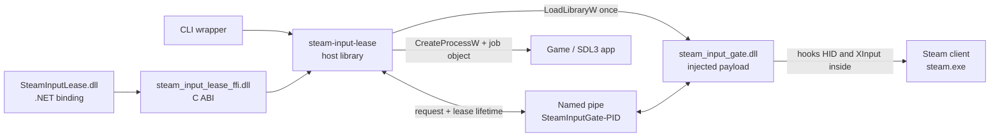

# Steam Input Lease

A Windows library and launch wrapper that temporarily stops the running Steam
client from opening, polling, or enumerating HID and XInput controllers — so a
controller-sensitive application (typically SDL3) can take direct control while
Steam Input is running.

Blocking is scoped to a **lease**. A lease is an open named-pipe connection, so
if your process crashes, blocking ends with it.

- Injects one process-local gate into `steam.exe`. Never into the game.
- The gate is pass-through whenever no lease is held.
- The first lease closes Steam's existing HID handles and denies new access.
- Concurrent leases are reference-counted.
- Releasing the last lease restores pass-through and asks Steam to rediscover
  controllers, without restarting Steam.

Ships as a Rust API, a stable C ABI, .NET 8 bindings, and a CLI.

> [!IMPORTANT]
> `0.1.0` enables and disables blocking dynamically, but never unloads the
> payload DLL — it is deliberately pinned. See
> [Payload lifetime](#payload-lifetime).

## Contents

- [Quick start](#quick-start) · [What it does and does not do](#what-it-does-and-does-not-do)
- [How it works](#how-it-works) · [Lease lifecycle](#lease-lifecycle)
- [Rust](#rust) · [C ABI](#c-abi) · [C#](#c) · [CLI](#cli)
- [Building and testing](#building-and-testing)
- [Internals](#internals) · [Controller recovery](#controller-recovery) · [Payload lifetime](#payload-lifetime)
- [Compatibility](#compatibility) · [Security](#security) · [Troubleshooting](#troubleshooting)
- [Repository and artifact layout](#repository-and-artifact-layout) · [Credits](#credits)

## Quick start

Keep these two files together:

```text
steam-input-lease.exe
steam_input_gate.dll
```

Set the game's Steam launch options to:

```text
"D:\path\steam-input-lease.exe" -- %command%
```

Everything after `--` is the original command; the wrapper handles Windows
quoting itself. The lease is held for as long as the game's process tree lives.

## What it does and does not do

It changes controller access **inside the Steam process only**. It does not
inject into the game, disable the Steam Overlay, restart or terminate Steam,
install a driver, hide a controller from Windows, drop a proxy DLL into Steam's
directory, modify Steam files on disk, or stop any other application from
opening controllers.

While a lease is held, Steam sees the same class of failures it would see if the
controller had been unplugged. The controller stays available to everything
else.

The HID boundary is controller-agnostic — any HID handle Steam owns can be
gated, not just Valve hardware. XInput state and capability queries are gated
across the supported system XInput DLLs.

## How it works



1. The host finds `steam.exe` in the caller's Windows session.
2. It connects to `\\.\pipe\SteamInputGate-<pid>`, injecting
   `steam_input_gate.dll` through remote `LoadLibraryW` if no payload is
   resident yet.
3. `AcquireLease` increments the payload's global lease count. On the zero-to-one
   transition the payload finds, cancels I/O on, and closes Steam's existing HID
   handles.
4. While the count is nonzero, HID opens, HID I/O, and XInput queries are denied
   inside Steam.
5. `ReleaseLease`, pipe EOF, or handle disposal decrements the count. At
   one-to-zero the hooks become pass-through immediately and controller
   rediscovery is requested.

Protocol version `1`. Requests are 8 bytes, responses 24 — fixed-width
`#[repr(C)]` structs shared by the host, payload, and C ABI.

## Lease lifecycle

| State | Leases | Hook behavior | Next transition |
|---|---:|---|---|
| Not loaded | — | No payload in target | Host injects on first acquire/ensure |
| Resident idle | 0 | Every detour forwards | First `AcquireLease` starts blocking |
| Blocking | ≥1 | HID/XInput denied | More clients increment |
| Final release | 1 → 0 | Pass-through is immediate | Payload requests rediscovery |
| Resident idle | 0 | Hooks installed but inert | Ready for the next lease |

Every acquired connection owns exactly one increment. After its first response
the payload worker blocks on a read, so an explicit `ReleaseLease` gets a
response, and a clean close, a crash, or a killed process all produce EOF.
Either way the count drops exactly once. Blocking persists until the *last*
concurrent client releases.

### Release timing

Release returns as soon as blocking is lifted and Steam has been asked to
rediscover — **not** once controllers are actually back. The payload issues a
required follow-up discovery request about 2.2 s later on its own timer thread,
so a caller that enumerates immediately may still see nothing for roughly a
second. This is deliberate: the caller no longer waits for it.

The exception is a legacy payload that does not advertise
`CAPABILITY_INTERNAL_RECOVERY`. There the host runs the two-pass recovery
itself, and `release()` blocks for roughly 4.5 s.

## Rust

```toml
[dependencies]
steam-input-lease = { path = "../SteamInput/crates/steam-input-lease" }
```

The default client targets the current-session `steam.exe` and expects
`steam_input_gate.dll` beside the consuming executable.

```rust
use steam_input_lease::Client;

fn main() -> Result<(), steam_input_lease::Error> {
    let client = Client::default();
    let lease = client.acquire()?;

    println!(
        "blocked; leases={}, revoked handles={}",
        lease.status().lease_count,
        lease.status().last_revoked_handle_count,
    );

    // Controller-sensitive work here.

    let released = lease.release()?;
    println!("remaining leases={}", released.status.lease_count);
    if let Some(error) = released.recovery.error() {
        // Blocking is lifted either way; Steam just was not asked to look again.
        eprintln!("controller recovery did not run: {error}");
    }
    Ok(())
}
```

Or wrap a whole process tree — created suspended, assigned to a job object, then
resumed, so descendants cannot escape the wait:

```rust
let exit_code = Client::default().run_wrapped([
    r"D:\Games\Example\game.exe",
    "--direct-input",
])?;
```

`Lease::release` is the observable path: it sends `ReleaseLease` and waits for
the response. Dropping a `Lease` closes the pipe and is crash-safe, but reports
neither status nor recovery outcome.

Release separates two outcomes that used to be conflated. An `Err` means the
release *handshake* failed. Recovery is reported in `ReleaseOutcome::recovery`,
because closing the pipe has already lifted blocking by the time recovery runs —
a recovery failure must not present a released lease as a failed one.

| `RecoveryOutcome` | Meaning |
|---|---|
| `NotRequired` | The target is not Steam |
| `Scheduled` | The payload will schedule discovery on its own timer |
| `Completed(RescanResult)` | The host ran guarded two-pass recovery inline |
| `Unavailable(Error)` | Recovery could not run; blocking was still lifted |

| Method | Purpose |
|---|---|
| `Client::acquire` | Take a lease, injecting if needed |
| `Client::run_wrapped` | Hold a lease around a child process tree |
| `Client::ensure_payload` | Load the payload without taking a lease |
| `Client::status` | Query a loaded payload; **never** injects |
| `Client::process_id` | Resolve the target pid |
| `Client::rescan` | Guarded two-pass discovery, no lease change |
| `Client::check_recovery` | Prove the current Steam build is resolvable; read-only |

| `Error` variant | Meaning |
|---|---|
| `TargetNotFound` | No matching process in this Windows session |
| `PayloadNotFound` | Injection needed but the DLL is absent |
| `ArchitectureMismatch` | Host and target architectures differ |
| `Protocol` | Pipe message, version, or result validation failed |
| `UnsupportedSteamBuild` | Analysis could not prove a unique safe recovery target |
| `Windows` | A Win32 call failed; the source carries its OS code |
| `Message` | A validated lifecycle condition failed |

## C ABI

Header: [`include/steam_input_lease.h`](include/steam_input_lease.h). Load
`steam_input_lease_ffi.dll` and deploy `steam_input_gate.dll` where the
configured payload path can find it.

```c
SilClient* client = NULL;
SilLease* lease = NULL;
SilStatus status = {0};
SilReleaseOutcome outcome = {0};
SilClientOptions options = {0};   /* all defaults */

if (sil_client_create(&options, &client) != SIL_OK) {
    fprintf(stderr, "%s\n", sil_last_error_message());
    return 1;
}
if (sil_client_acquire(client, &lease, &status) == SIL_OK) {
    /* Controller-sensitive work. */
    sil_lease_release(lease, &outcome);   /* consumes the lease */
    lease = NULL;
    if (outcome.recovery == SIL_RECOVERY_UNAVAILABLE) {
        /* Blocking was lifted; Steam just was not asked to look again. */
        fprintf(stderr, "%s\n", outcome.recovery_message);
    }
}
sil_lease_destroy(lease);   /* crash-safe close; accepts NULL */
sil_client_destroy(client);
```

| Export | Purpose |
|---|---|
| `sil_abi_version` | ABI version of the loaded DLL |
| `sil_last_error_message` | Borrowed thread-local UTF-8 error text |
| `sil_client_create` / `sil_client_destroy` | Client lifetime |
| `sil_client_ensure_payload` | Load the payload without leasing |
| `sil_client_status` | Query a loaded payload; never injects |
| `sil_client_acquire` | Take a lease |
| `sil_lease_release` | Explicit release; consumes the lease |
| `sil_lease_destroy` | Crash-safe close; accepts `NULL` |
| `sil_client_rescan` | Guarded two-pass discovery |
| `sil_client_check_recovery` | Prove the Steam build is resolvable |
| `sil_client_run_wrapped` | Hold a lease around a child process tree |

| Result | Value | Meaning |
|---|---:|---|
| `SIL_OK` | 0 | Success |
| `SIL_ERROR` | 1 | Validated native operation failed |
| `SIL_PANIC` | 2 | A Rust panic was caught at the boundary |

`SilStatus` carries a `capabilities` bitset; `SIL_CAPABILITY_INTERNAL_RECOVERY`
indicates the payload runs its own recovery on final release.

`sil_lease_release` returning `SIL_OK` means blocking was lifted.
`SilReleaseOutcome::recovery` separately reports whether Steam was also asked to
rediscover controllers — `SIL_RECOVERY_NOT_REQUIRED`, `SIL_RECOVERY_SCHEDULED`,
`SIL_RECOVERY_COMPLETED` (with `rescan` populated), or
`SIL_RECOVERY_UNAVAILABLE` (with a UTF-8 `recovery_message`). The reason travels
inside the struct because `sil_last_error_message()` reports failed calls only,
and this call succeeded.

**Ownership rules.** Create one `SilClient*` and destroy it once. Consume each
`SilLease*` exactly once — `sil_lease_release` consumes it even when it returns
an error, *except* when it rejects a `NULL` argument before taking ownership.
`sil_lease_destroy` is the non-reporting close path.

**Error lifetime.** `sil_last_error_message()` returns a borrowed,
NUL-terminated, thread-local pointer that is never `NULL`. Copy it before the
next ABI call on that thread — note that a *successful* call also resets it to
an empty string. Never modify or free it.

## C#

The .NET 8 binding wraps both opaque handle types in `SafeHandle`.

```csharp
using SteamInputLease;

using var client = new SteamInputClient();

using SteamInputBlockLease lease = client.Acquire();
Console.WriteLine($"Revoked: {lease.InitialStatus.LastRevokedHandleCount}");

// Controller-sensitive work.

SteamInputReleaseOutcome released = lease.Release();
Console.WriteLine($"Leases after release: {released.Status.LeaseCount}");
if (!released.RecoveryRequested)
{
    // Blocking is lifted either way; Steam just was not asked to look again.
    Console.Error.WriteLine(released.RecoveryMessage);
}
```

```csharp
using var client = new SteamInputClient(new SteamInputClientOptions
{
    TargetName = "steam.exe",
    PayloadPath = Path.Combine(AppContext.BaseDirectory, "steam_input_gate.dll"),
    ConnectTimeout = TimeSpan.FromSeconds(10),
});

uint exitCode = client.RunWrapped(@"D:\Games\Example\game.exe", "--direct-input");
```

| Member | Notes |
|---|---|
| `SteamInputClient` | `IDisposable`; `Acquire`, `RunWrapped`, `EnsurePayload`, `GetStatus`, `Rescan`, `CheckRecovery` |
| `SteamInputClientOptions` | `TargetName`, `PayloadPath`, `ConnectTimeout` (all `init`) |
| `SteamInputBlockLease` | `InitialStatus`, `Release()`, `Dispose()`; obtained only from `Acquire()` |
| `SteamInputStatus` | `readonly record struct (ushort Capabilities, uint LeaseCount, uint HidHandleCount, uint LastRevokedHandleCount)` plus `SupportsInternalRecovery` |
| `SteamControllerRescanResult` | `(double PreviousDeadline, uint ScanCountBefore, uint ScanCountAfter)` |
| `SteamInputLeaseException` | Carries `int NativeResult` |

`Release()` performs the explicit handshake and consumes the managed lease;
`Dispose()` closes the crash-safe pipe if `Release()` was not called.

Available as a project reference or the generated local NuGet package. Build the
Cargo **release** artifacts first — the package's native assets are conditional
on `target\release\*.dll` existing, so packing without them silently produces a
managed-only package.

```powershell
.\scripts\build.ps1
dotnet add package SteamInputLease --version 0.1.0 --source .\artifacts\packages
```

## CLI

```text
steam-input-lease.exe -- %command%
steam-input-lease.exe --status
steam-input-lease.exe --rescan
steam-input-lease.exe --target-name process.exe --payload D:\path\steam_input_gate.dll -- command.exe args...
```

| Option | Behavior |
|---|---|
| `--` | Ends wrapper options; the rest is the child argument vector |
| `--status` | Queries an already loaded payload; never injects |
| `--rescan` | Guarded two-pass discovery without changing leases |
| `--target-name NAME` | Overrides `steam.exe`; for diagnostics and tests |
| `--payload PATH` | Overrides the DLL beside the CLI |
| `--help`, `-h` | Prints usage |

`--status` and `--rescan` take precedence over a wrapped command if both are
given. There is no CLI flag for `check_recovery`; use the Rust, C, or C# API.

**Exit codes.** The CLI returns the child's exit code **clamped to 0–255**, so
any code at or above 255 — including NTSTATUS crash codes like `0xC0000005` —
becomes `255`. `--status`, `--rescan`, and `--help` return `0`; errors return
`1`. Library callers (Rust, C ABI, C#) receive the full `u32` instead.

## Building and testing

```powershell
cargo build --workspace --release
dotnet build .\bindings\SteamInputLease.Net\SteamInputLease.Net.csproj -c Release
```

Quality gates:

```powershell
cargo clippy --workspace --all-targets -- -D warnings
cargo test --workspace
$env:RUSTDOCFLAGS = '-D warnings'; cargo doc --workspace --no-deps; Remove-Item Env:RUSTDOCFLAGS
```

The library crates use `#![deny(missing_docs)]`, so undocumented public API is a
compile error.

### Isolated injection test

```powershell
.\scripts\test-lifecycle.ps1 -Profile release
```

`-Profile` defaults to `debug`. This test touches neither Steam nor a real
controller. It starts `steam-input-test-target.exe` as a TCP-controlled process,
then checks that opening a deliberately nonexistent HID-style path:

1. fails with an ordinary error (not blocked) before any lease;
2. fails with `433` (`ERROR_NO_SUCH_DEVICE`) while a lease is held, with the
   payload injected implicitly by the wrapped launcher run;
3. returns to the ordinary not-blocked error after release.

It also asserts the wrapped child's exit code is propagated exactly (`23`) and
that the resident payload still answers a non-injecting `--status` query. Steps
1 and 3 assert only that the result is *not* the blocked error, not a specific
code.

### Package

```powershell
.\scripts\build.ps1
```

Builds the workspace and the managed project, then writes the portable layout to
`artifacts\win-x64` and the NuGet package to `artifacts\packages`. The
`-Runtime` parameter only relabels the output directory; it does not
cross-compile.

The shipped C# sample (`samples\SteamInputLease.CSharpExample`) reads
`SIL_TARGET_NAME` and `SIL_PAYLOAD_PATH` from the environment. With no arguments
it calls `EnsurePayload()`; otherwise it wraps its arguments with `RunWrapped`.

## Internals

### Injection

The host opens the target with the rights needed for remote `LoadLibraryW`,
verifies architecture with `IsWow64Process2`, resolves the target's
`kernel32.dll` base through Toolhelp, and computes the remote `LoadLibraryW`
address from the local export's module-relative offset — so it never assumes
ASLR picked the same base twice. The UTF-16 payload path is written with
`VirtualAllocEx`/`WriteProcessMemory`, a remote thread calls `LoadLibraryW`, and
the remote memory is freed afterwards. The payload then starts its pipe server.

### Hook coverage

| Boundary | Hooked | Blocked behavior |
|---|---|---|
| Win32 opens | `CreateFileW`, `CreateFileA`, `CreateFile2` | HID paths fail with `ERROR_NO_SUCH_DEVICE` |
| Native opens | `NtCreateFile`, `NtOpenFile` | HID paths fail with `STATUS_DEVICE_NOT_CONNECTED` |
| Native HID I/O | `NtReadFile`, `NtWriteFile`, `NtDeviceIoControlFile` | Known HID handles complete as disconnected |
| Handle lifetime | `NtClose` | Drops closed handles from the table |
| XInput | `XInputGetState`/ordinal 100, `XInputGetCapabilities`/ordinal 108 | `ERROR_DEVICE_NOT_CONNECTED` |

XInput is hooked, where present, in `xinput1_4`, `xinput1_3`, `xinput1_2`,
`xinput1_1`, and `xinput9_1_0`. Required hooks are all queued before
`MH_ApplyQueued`, so initialization can never leave a partially enabled gate.
XInput exports are optional because not every DLL exposes every entry point.

### Existing handle discovery

The open hooks cannot see handles Steam opened before injection. On the
zero-to-one transition the payload enumerates **this process's** handle table
via `NtQueryInformationProcess(ProcessHandleInformation)`, falling back to the
system-wide `NtQuerySystemInformation` sweep only where that class is
unavailable. It keeps `File` objects, skips disk and pipe handles (probing those
could block on unrelated Steam IPC), identifies HID handles with
`HidD_GetAttributes` under a thread-local probe bypass, then cancels pending I/O
and closes them.

Closing is necessary, not merely tidy: denying I/O alone would leave Steam
holding a share-incompatible handle that keeps the SDL3 application from opening
the controller at all.

### Handle table

Detour bodies never allocate. Classifications live in a fixed 4096-slot
open-addressing table behind an `RwLock`, with key `0` empty and key `1` a
tombstone, and probing bounded to 16 slots so no detour can degrade into a
full-table walk. The HID count is maintained atomically for status reporting.
`NtClose` takes only a shared lock unless the handle is actually tracked.

## Controller recovery

Restoring pass-through is not enough to make Steam notice a controller again —
its controller I/O thread has to be told to run discovery.

Everything is resolved from the loaded `steamclient64.dll` at runtime. There is
no Steam version table, no fixed RVA, and no hardcoded object-field offset
anywhere in the production implementation. The `steam-input-recovery` crate:

1. validates the loaded PE32+ image and its sections;
2. locates the MSVC RTTI name `.?AVCHIDIOThread@CSteamController@@`;
3. recovers the primary and secondary vtables through its complete-object
   locators;
4. decodes the first virtual methods with an x64 instruction decoder and
   identifies the scheduler *by semantics* — it loads a double deadline,
   increments a counter through the same object base, then stores the deadline
   back;
5. derives the deadline and counter offsets from those decoded operands;
6. finds the live object in private memory carrying that vtable pair.

Every stage of the *image* analysis must be unique. Anything missing or
ambiguous **fails closed** — no internal field is written. Before writing, both
vtables and the field's alignment and plausibility are re-verified.

### Electing the live object

Step 6 can legitimately match more than one address. Revoking Steam's HID
handles makes it tear down and rebuild its controller I/O thread, and the freed
heap block keeps the class vtables and a plausible deadline until the allocator
hands that memory out again. Such a block is byte-for-byte a valid object, so no
structural check can reject it.

Only the object a live thread owns keeps scheduling discovery. When several
candidates survive validation, both the host and the payload therefore sample
each candidate's deadline and counter, post the same device-change notification
used as the unknown-build fallback so the running thread has a reason to
reschedule, and re-sample for up to 1.5 s. **Exactly one** candidate moving
elects it; no movement, or movement in several, still fails closed. The election
never writes to Steam, and the deadline is compared as raw bits so a field
holding NaN in both samples is not mistaken for movement.

The deadline is then set to the IEEE-754 bits of `-1.0`, which makes the HID
thread schedule discovery on its next loop. Recovery is two-pass because closing
Steam's handle can leave queued zombie-controller cleanup: the second request,
issued ~2.2 s later, makes the post-cleanup state durable. The payload issues it
on a shared timer thread rather than making the caller wait.

If the layout cannot be proven, the payload falls back to a Steam-window
device-change notification plus `SDL_UpdateJoysticks` when that export is
loaded.

## Payload lifetime

`0.1.0` distinguishes two meanings of "off":

- **Functionally off** — `lease_count == 0`; every hook forwards and Steam is no
  longer blocked. Fully supported.
- **Structurally unloaded** — the image, hooks, and threads removed from Steam.
  Not supported.

At startup the payload pins itself with `GetModuleHandleExW` and
`GET_MODULE_HANDLE_EX_FLAG_PIN`. A pinned module cannot be unpinned for the life
of the process. This is what stops a hook trampoline or a detached worker from
executing after the image is unmapped, and it is why protocol version 1 has no
`Shutdown`, `Detach`, or `FreeLibrary` operation.

**Do not manually unmap the payload.** Doing so can leave instruction pointers,
hook targets, or server threads referencing freed memory and crash Steam. A
clean unload would require a full quiesce protocol — reject new acquisitions,
drain to zero leases, stop accepting clients, join every worker, disable hooks,
drain executing detours, remove trampolines, and only then call remote
`FreeLibrary`. An already loaded pinned payload cannot be converted into a
safely unloadable one in place.

## Compatibility

- Windows-only; current production use assumes the x64 Steam client.
- The HID/XInput gate itself does not depend on any Steam offset.
- Recovery contains no build table and no fixed RVAs, so routine Steam updates
  that move code, vtables, or object fields are re-resolved automatically.
- A substantial Valve refactor can still break recovery — stripping RTTI,
  renaming or replacing `CHIDIOThread`, changing its inheritance, or rewriting
  the scheduler so the validated instruction semantics disappear.
- Protocol version `1` stays compatible with older payloads; one that does not
  advertise internal recovery triggers host-side recovery on explicit release.

When Valve changes something structural, fix the semantic resolver — do not add
a build-specific offset profile. Verify both that the scan counter advances and
that a real block/release controller cycle works before shipping such a change.

## Security

This project performs process injection and API hooking by design:

- Endpoint-security products may flag or block remote `LoadLibraryW` injection.
- A lower-integrity process cannot open a higher-integrity Steam process with
  the required rights.
- The host does not bypass access controls, elevate itself, or disable security
  software.
- Process discovery is restricted to the caller's Windows session, so a service
  or a second signed-in user cannot become the target.
- The payload pipe rejects remote clients.
- Build and distribute from a trusted source — replacing the injected DLL
  changes code that runs inside Steam.

The production library creates no network service. The localhost TCP listener
exists only in `steam-input-test-target` during the isolated test.

## Troubleshooting

| Symptom | Cause and fix |
|---|---|
| `target process is not running: steam.exe` | Steam is not in your session, or the diagnostic target name is wrong |
| `payload not found` | Keep `steam_input_gate.dll` beside the exe, or set `--payload` / `payload_path` |
| `OpenProcess failed`, architecture mismatch | Run at a compatible integrity level; do not mix x86 and x64 artifacts |
| Payload loaded but pipe never appeared | Hook init or server startup failed, or security software interrupted injection |
| `--status` says not loaded | Expected before the first `EnsurePayload` or lease — `--status` never injects |
| DLL cannot be overwritten | A loaded payload is locked and pinned; build to a separate output directory |

**Unsupported Steam layout.** The resolver could not uniquely prove the RTTI,
vtables, scheduler fields, or live object. HID/XInput pass-through is still
restored, but no internal discovery is written. The error text names the stage
that failed. Treat ambiguity as a resolver bug or a Valve structural change —
never substitute unvalidated offsets.

**Controller does not reappear.**

1. Confirm the final status reports `leases=0`.
2. Run `steam-input-lease.exe --rescan` and check the scan counter advances.
3. Confirm Windows still enumerates the controller's HID interface — Steam
   cannot rediscover hardware that is asleep or absent at the OS level.
4. Wake or reconnect the controller and let the normal Windows hotplug fire.
5. Check Steam's `logs\controller.txt` for open/close transitions.

Remember that release returns before rediscovery completes; give it a second
before concluding it failed.

## Repository and artifact layout

| Package | Output | Responsibility |
|---|---|---|
| `steam-input-lease-core` | rlib | Wire protocol, capability flags, pipe naming |
| `steam-input-recovery` | rlib | Build-independent RTTI/vtable/instruction resolver |
| `steam-input-lease` | rlib | Discovery, injection, IPC, leases, process wrapper |
| `steam-input-gate` | `steam_input_gate.dll` | Injected hook engine and pipe server |
| `steam-input-lease-ffi` | `steam_input_lease_ffi.dll` | Stable C ABI |
| `steam-input-lease-cli` | `steam-input-lease.exe` | Launch wrapper and diagnostics |
| `SteamInputLease.Net` | `SteamInputLease.dll` | .NET 8 `SafeHandle` binding |
| `steam-input-test-target` | test exe | Isolated injection validation target |

```text
SteamInput/                       artifacts/            (after build.ps1)
├── crates/                       ├── packages/
│   ├── steam-input-gate/         │   └── SteamInputLease.0.1.0.nupkg
│   ├── steam-input-lease/        └── win-x64/
│   ├── steam-input-lease-cli/        ├── steam-input-lease.exe
│   ├── steam-input-lease-core/       ├── steam_input_gate.dll
│   ├── steam-input-lease-ffi/        ├── steam_input_lease_ffi.dll
│   ├── steam-input-recovery/         ├── LICENSE-MIT
│   └── steam-input-test-target/      ├── README.md
├── bindings/SteamInputLease.Net/     ├── THIRD_PARTY_LICENSES.md
├── include/steam_input_lease.h       ├── include/
├── samples/                          ├── managed/
└── scripts/                          └── native/
```

The root native copies support direct CLI use; `native/` and `managed/` support
embedding and redistribution.

## Credits

The blocking model was informed by SpecialKO's ValvePlug. The payload uses
MinHook through the `minhook-sys` crate, and the resolver uses the `iced-x86`
decoder.

Project code is under [`LICENSE-MIT`](LICENSE-MIT). Third-party terms are in
[`THIRD_PARTY_LICENSES.md`](THIRD_PARTY_LICENSES.md).
